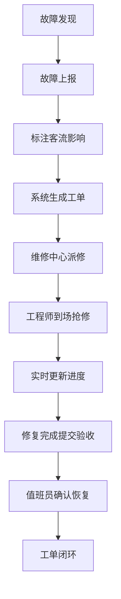
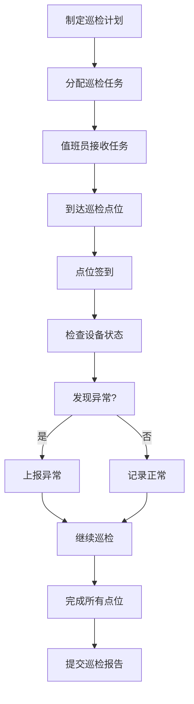
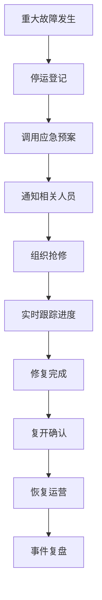

## 1. 产品概述

轨道交通车站设备运维管理系统，面向车站值班员、维修中心和线路管理人员，提供设备全生命周期运维管理，提升运营效率和应急响应能力。

- **核心目标**：实现设备状态可视化、故障处理流程化、运维管理数字化
- **目标用户**：车站值班员、维修中心工程师、线路管理人员
- **市场价值**：降低设备故障率，缩短故障处理时间，提升轨道交通运营安全性和服务质量

## 2. 核心功能

### 2.1 用户角色

| 角色 | 注册方式 | 核心权限 |
|------|---------|---------|
| 车站值班员 | 系统分配 | 设备状态查看、故障上报、巡检执行、值班日志填写、应急处置 |
| 维修中心工程师 | 系统分配 | 工单接收与处理、派修协同、抢修进度更新、备件申请、供应商管理 |
| 线路管理人员 | 系统分配 | 全线总览、运营分析、设备可靠性评估、事件复盘、超时提醒管理 |

### 2.2 功能模块

1. **线路总览**：全线设备状态地图、实时告警、客流影响概览
2. **车站设备**：扶梯、闸机、屏蔽门分类管理、设备详情、运行状态
3. **故障工单**：故障上报、派修协同、抢修进度跟踪、超时提醒
4. **例行巡检**：巡检计划管理、点位签到、巡检记录查询
5. **应急处置**：应急预案调用、停运登记、复开确认、事件复盘
6. **备件周转**：备件库存管理、调拨申请、出入库记录
7. **值班日志**：值班交接、事件记录、供应商记录
8. **运营分析**：设备可靠性排名、故障统计、客流影响分析、KPI仪表盘

### 2.3 页面详情

| 页面名称 | 模块名称 | 功能描述 |
|---------|---------|---------|
| 线路总览 | 线路地图 | 可视化展示全线车站及设备状态分布 |
| 线路总览 | 实时告警面板 | 展示当前未处理的故障告警，按优先级排序 |
| 线路总览 | 客流影响概览 | 统计当前故障对各站点客流的影响程度 |
| 线路总览 | 关键指标卡片 | 展示在线设备率、工单处理率、平均修复时间等KPI |
| 车站设备 | 设备分类标签 | 扶梯、闸机、屏蔽门三类设备切换 |
| 车站设备 | 设备列表 | 展示该类设备的编号、位置、状态、运行时长 |
| 车站设备 | 设备详情 | 查看设备详细参数、历史故障、维护记录 |
| 车站设备 | 快速报修 | 从设备页面一键发起故障上报 |
| 故障工单 | 工单列表 | 按状态、优先级筛选展示所有工单 |
| 故障工单 | 故障上报表单 | 填写故障信息、影响客流标注、上传照片 |
| 故障工单 | 派修协同 | 指派维修人员、设置预计到达时间 |
| 故障工单 | 抢修进度 | 实时更新维修进度、记录处理过程 |
| 故障工单 | 超时提醒 | 自动标记超期工单，发送提醒通知 |
| 例行巡检 | 巡检计划 | 查看每日/每周巡检任务、巡检点位 |
| 例行巡检 | 点位签到 | 扫码或定位签到、记录巡检结果 |
| 例行巡检 | 巡检记录 | 历史巡检数据查询、异常记录统计 |
| 应急处置 | 应急预案库 | 按类型检索和调用应急预案 |
| 应急处置 | 停运登记 | 记录设备停运时间、影响范围、预计恢复时间 |
| 应急处置 | 复开确认 | 设备修复后确认复开、记录恢复时间 |
| 应急处置 | 事件复盘 | 记录事件全过程、分析原因、制定改进措施 |
| 备件周转 | 库存总览 | 展示各类备件库存数量、库存预警 |
| 备件周转 | 备件调拨 | 发起调拨申请、审批流程、调拨记录 |
| 备件周转 | 出入库记录 | 详细的备件出入库流水账 |
| 值班日志 | 值班记录 | 填写当班期间的重要事件、设备状态 |
| 值班日志 | 值班交接 | 交接班记录、待办事项移交 |
| 值班日志 | 供应商记录 | 记录供应商到场时间、服务内容、评价 |
| 运营分析 | 可靠性排名 | 按设备类型、品牌、车站统计故障率和MTBF |
| 运营分析 | 故障统计 | 按时间、类型、站点多维度统计故障 |
| 运营分析 | 客流影响分析 | 分析故障对客流的影响程度和持续时间 |
| 运营分析 | KPI仪表盘 | 展示核心运维指标趋势和达成情况 |

## 3. 核心流程

### 3.1 故障处理流程

值班员发现设备故障，在系统中上报故障信息并标注客流影响，系统自动生成工单。维修中心接收工单后派修，工程师到场抢修并实时更新进度，修复完成后提交验收，值班员确认设备恢复正常，工单闭环。

### 3.2 巡检执行流程

管理人员制定巡检计划并分配任务，值班员按照计划执行巡检，在各点位签到并记录设备状态，发现异常及时上报，巡检完成后提交巡检报告。

### 3.3 应急处置流程

发生重大设备故障时，值班员登记停运信息，调用应急预案，通知相关人员，维修中心组织抢修，修复后进行复开确认，最后进行事件复盘总结。

## 4. 用户界面设计

### 4.1 设计风格

- **主色调**：深蓝色 (#165DFF) 代表专业、可靠，辅以工业蓝 (#0E42D2) 和浅蓝 (#E8F3FF)
- **辅助色**：橙色 (#FF7D00) 表示警告/待处理，绿色 (#00B42A) 表示正常，红色 (#F53F3F) 表示故障/紧急
- **中性色**：深灰 (#1D2129) 正文，中灰 (#4E5969) 次要文字，浅灰 (#C9CDD4) 边框，极浅灰 (#F2F3F5) 背景
- **按钮风格**：直角微圆角 (4px)，实色填充主按钮，边框按钮用于次要操作
- **字体**：思源黑体 (Source Han Sans) 作为主字体，清晰易读，适合工业系统
- **布局风格**：侧边导航 + 顶部工具栏 + 内容区域三栏布局，卡片式信息展示
- **图标风格**：线性图标，统一2px描边，风格简洁专业

### 4.2 页面设计概览

| 页面名称 | 模块名称 | UI元素 |
|---------|---------|--------|
| 线路总览 | 线路地图 | 深蓝色渐变背景，站点用不同颜色圆点表示状态，hover显示详情气泡 |
| 线路总览 | 告警面板 | 左侧列表，紧急故障红色高亮，进度条显示处理进度 |
| 线路总览 | KPI卡片 | 白色卡片带轻微阴影，数字大号加粗，趋势箭头指示 |
| 车站设备 | 分类标签 | 顶部Tab切换，选中状态下划线强调 |
| 车站设备 | 设备卡片 | 网格布局，设备状态用颜色条标识在卡片顶部 |
| 故障工单 | 工单列表 | 表格布局，优先级用彩色标签，状态用进度条展示 |
| 故障工单 | 上报表单 | 分步骤表单，必填项星号标记，照片上传区域拖拽上传 |
| 例行巡检 | 点位地图 | 站内平面图，巡检点用可点击标记 |
| 应急处置 | 预案卡片 | 分类展示，点击展开详细内容 |
| 运营分析 | 图表 | ECharts图表，支持时间范围筛选，数据钻取 |

### 4.3 响应式

- **桌面优先**：针对1920×1080及以上分辨率优化，信息密度适中
- **平板适配**：侧边栏可折叠，表格支持横向滚动
- **触控优化**：重要操作按钮尺寸≥44px，确保触控准确

### 4.4 交互动效

- 页面加载：内容区域淡入，侧边导航从左滑入
- 卡片hover：轻微上移 + 阴影加深
- 数据更新：数字变化时滚动动画
- 告警提示：新告警从右侧滑入，带轻微震动效果
- 状态切换：平滑过渡动画，时长0.3s
