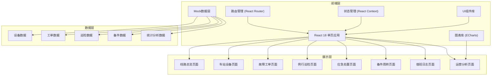

## 1. 架构设计



## 2. 技术描述

- **前端框架**：React@18 + TypeScript
- **构建工具**：Vite@5
- **样式方案**：TailwindCSS@3
- **路由管理**：React Router@6
- **图表库**：ECharts@5
- **图标库**：Lucide React
- **状态管理**：React Context + useReducer
- **数据模拟**：Mock数据 + TypeScript类型定义
- **代码规范**：ESLint + Prettier

## 3. 路由定义

| 路由 | 页面 | 说明 |
|------|------|------|
| / | 线路总览 | 首页，展示全线设备状态概览 |
| /devices | 车站设备 | 扶梯、闸机、屏蔽门分类管理 |
| /tickets | 故障工单 | 故障上报、派修、进度跟踪 |
| /inspection | 例行巡检 | 巡检计划、点位签到 |
| /emergency | 应急处置 | 应急预案、停运复开管理 |
| /spare-parts | 备件周转 | 备件库存、调拨管理 |
| /duty-log | 值班日志 | 值班记录、交接管理 |
| /analytics | 运营分析 | 数据分析、KPI仪表盘 |

## 4. 类型定义

```typescript
// 设备类型
type DeviceType = 'escalator' | 'gate' | 'platform-door';
type DeviceStatus = 'normal' | 'warning' | 'fault' | 'maintenance';

interface Device {
  id: string;
  name: string;
  type: DeviceType;
  station: string;
  location: string;
  status: DeviceStatus;
  runHours: number;
  lastMaintenance: string;
  brand: string;
  model: string;
  installDate: string;
}

// 工单类型
type TicketPriority = 'low' | 'medium' | 'high' | 'urgent';
type TicketStatus = 'pending' | 'assigned' | 'processing' | 'completed' | 'closed';

interface Ticket {
  id: string;
  title: string;
  description: string;
  deviceId: string;
  deviceName: string;
  station: string;
  reporter: string;
  priority: TicketPriority;
  status: TicketStatus;
  passengerImpact: string;
  createdAt: string;
  assignedTo?: string;
  estimatedArrival?: string;
  progress: number;
  photos: string[];
}

// 巡检类型
interface InspectionPoint {
  id: string;
  name: string;
  station: string;
  location: string;
  deviceType: DeviceType;
}

interface InspectionTask {
  id: string;
  name: string;
  date: string;
  inspector: string;
  points: InspectionPoint[];
  completedPoints: string[];
  status: 'pending' | 'in-progress' | 'completed';
}

// 备件类型
interface SparePart {
  id: string;
  name: string;
  code: string;
  category: string;
  quantity: number;
  minStock: number;
  unit: string;
  location: string;
}

// 统计数据类型
interface AnalyticsData {
  date: string;
  faultCount: number;
  repairTime: number;
  availability: number;
}
```

## 5. 项目目录结构

```
src/
├── components/          # 公共组件
│   ├── Layout/         # 布局组件
│   ├── Sidebar/        # 侧边导航
│   ├── Header/         # 顶部导航
│   ├── Card/           # 卡片组件
│   ├── Table/          # 表格组件
│   ├── StatusBadge/    # 状态标签
│   └── Modal/          # 弹窗组件
├── pages/              # 页面组件
│   ├── Dashboard/      # 线路总览
│   ├── Devices/        # 车站设备
│   ├── Tickets/        # 故障工单
│   ├── Inspection/     # 例行巡检
│   ├── Emergency/      # 应急处置
│   ├── SpareParts/     # 备件周转
│   ├── DutyLog/        # 值班日志
│   └── Analytics/      # 运营分析
├── types/              # TypeScript类型定义
├── data/               # Mock数据
├── hooks/              # 自定义Hooks
├── utils/              # 工具函数
├── context/            # Context状态管理
├── App.tsx
├── main.tsx
└── index.css
```

## 6. 核心组件说明

### 6.1 布局组件
- **Sidebar**: 左侧导航菜单，支持折叠，8个菜单项
- **Header**: 顶部工具栏，包含用户信息、通知、搜索
- **MainContent**: 主内容区域，带内边距和滚动

### 6.2 业务组件
- **DeviceCard**: 设备状态卡片，显示设备基本信息和状态
- **TicketList**: 工单列表，支持筛选和排序
- **LineMap**: 线路地图可视化组件
- **KPICard**: KPI指标卡片，带趋势显示
- **ProgressTimeline**: 抢修进度时间线

## 7. 数据模型（Mock）

### 7.1 初始数据
- 3条线路，每线路10-15个车站
- 每站配置：8-12台扶梯、12-18台闸机、24-32扇屏蔽门
- 初始生成50-80条历史工单
- 20-30种备件品类
- 巡检点位覆盖所有设备类型

### 7.2 实时模拟
- 随机生成新的故障告警（每5-10分钟1条）
- 工单状态自动流转模拟
- 设备运行时长实时累加
